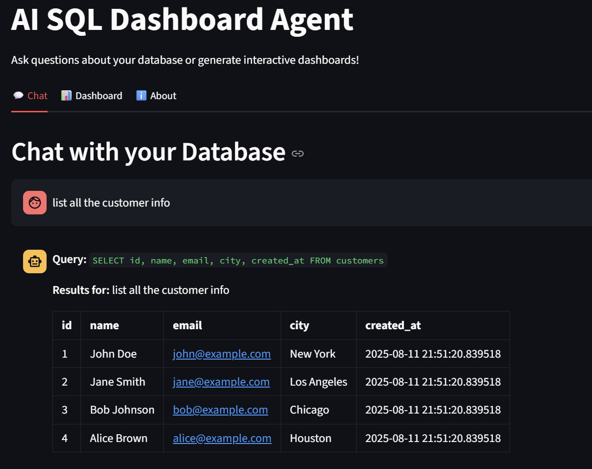
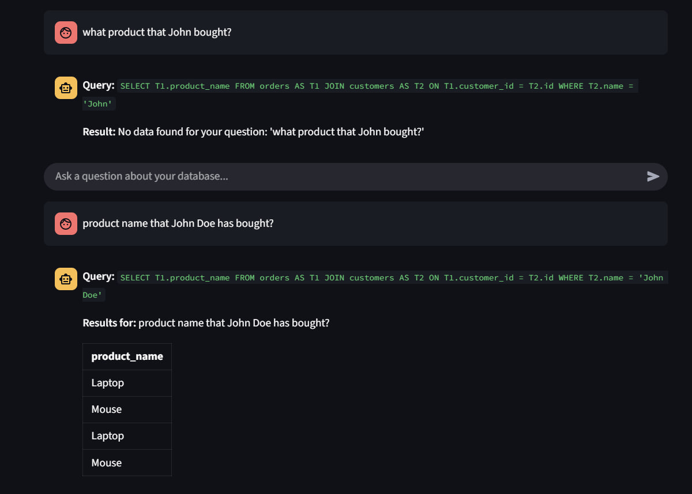
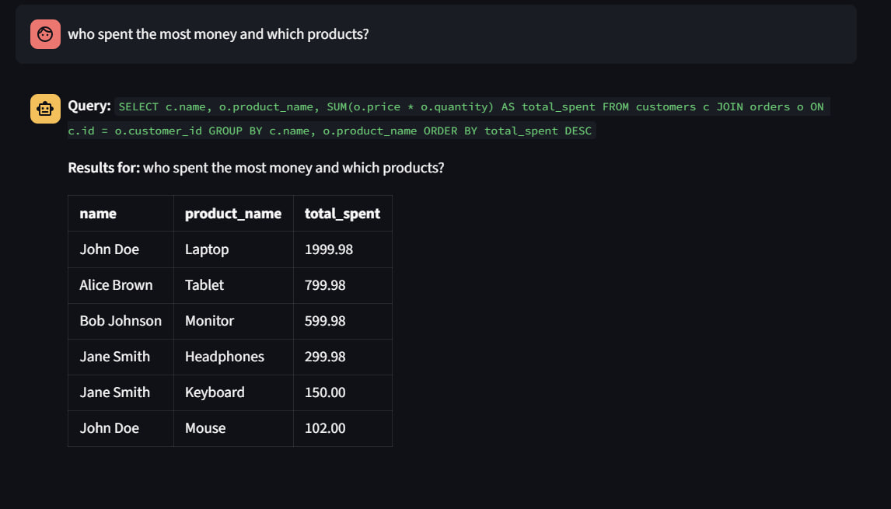
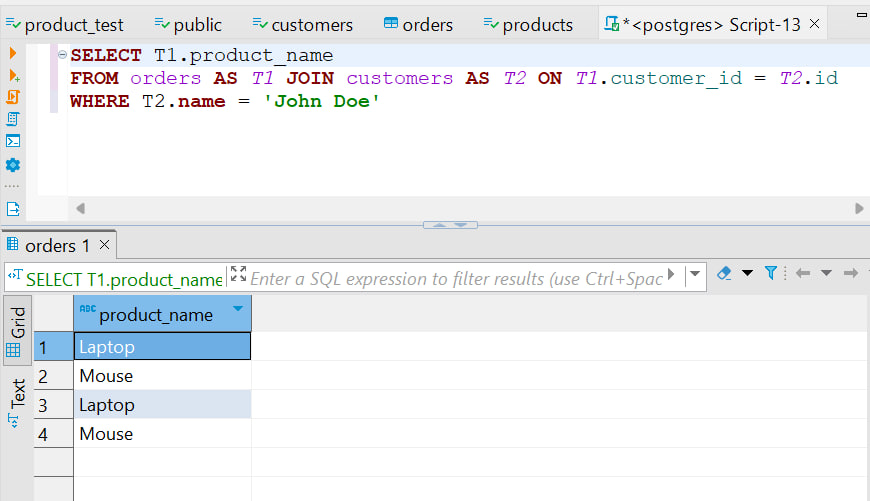
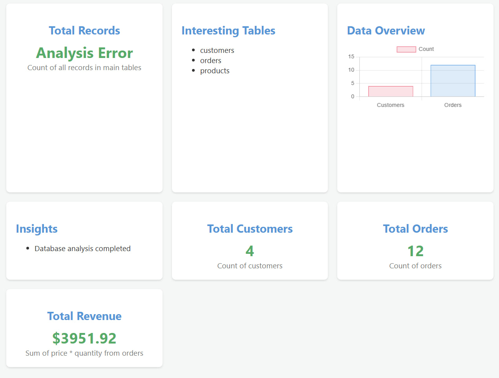

# AI SQL Dashboard Agent

A complete AI-powered SQL dashboard system that converts natural language questions into SQL queries and generates interactive dashboards. Built with Streamlit, PostgreSQL, and MCP (Model Context Protocol).

## Video Demonstration
[Watch the Video](https://youtu.be/sioxAVhg-VY)

## Sample Testing
<p align="center">
  
  
  
  
  
</p>

## 🚀 Features

- **Natural Language Queries**: Ask questions in plain English, get SQL results
- **Auto Dashboard Generation**: AI analyzes your database structure and creates visualizations
- **Secure Database Access**: Read-only access through MCP server layer
- **Multi-Model Support**: OpenAI GPT, Anthropic Claude, or Groq models
- **Interactive UI**: Modern Streamlit interface with chat and dashboard tabs

## 📁 Project Structure

```
ai_sql_dashboard/
├── app.py                   # Streamlit main application
├── agents/
│   ├── __init__.py
│   ├── chat_agent.py        # Natural language to SQL conversion
│   ├── dashboard_agent.py   # Dashboard generation logic
│   ├── model_utils.py       # LLM model management
│   └── validation.py        # JSON validation utilities
├── mcp_server/
│   ├── __init__.py
│   ├── sql_read_only.py     # MCP SQL server implementation
│   └── tools.py             # Database tool handlers
├── utils/
│   ├── __init__.py
│   ├── display.py           # HTML display utilities
│   └── env_utils.py         # Environment management
├── requirements.txt
├── .env.example
├── setup_db.py             # Database setup script
├── LICENSE 
└── README.md
```

## 🛠️ Installation & Setup

### 1. Clone and Setup Environment

```bash
# Clone the repository (or create the directory structure)
mkdir ai_sql_dashboard
cd ai_sql_dashboard

# Create virtual environment
python -m venv venv
source venv/bin/activate  # On Windows: venv\Scripts\activate

# Install dependencies
pip install -r requirements.txt
```

### 2. PostgreSQL Database Setup

#### Option in Local PostgreSQL Installation

```bash
# Ubuntu/Debian
sudo apt-get update
sudo apt-get install postgresql postgresql-contrib

# macOS with Homebrew
brew install postgresql
brew services start postgresql

# Windows
# Download and install from: https://www.postgresql.org/download/windows/
```

### 3. Environment Configuration

```bash
# Copy example environment file
cp .env.example .env

# Edit .env with your configuration
nano .env
```

#### .env Configuration

```bash
# Database Configuration
DB_HOST=localhost
DB_PORT=5432
DB_USERNAME=dashboard_user
DB_PASSWORD=your_password_here
DB_NAME=ai_dashboard_db

# LLM Configuration
MODEL_ID=gemini-2.0-flash
MODEL_API_KEY=api_key_here_from_gemini

# MCP Server Configuration
MCP_SERVER_HOST=localhost
MCP_SERVER_PORT=8000
```

### 4. Database Initialization

```bash
# Run the database setup script to create sample data
python setup_db.py
```

This creates sample `customers` and `orders` tables with test data.

### 5. API Keys Setup

#### Google Gemini 
1. Go to https://aistudio.google.com/app/apikey
2. Create a new API key
3. Add to .env as `MODEL_API_KEY`

## 🚀 Running this Application

### Step 1: Start MCP Server

In terminal 1:
```bash
cd ai_sql_dashboard
source venv/bin/activate
python -m mcp_server.sql_read_only
```

You should see:
```
Database connection pool initialized
MCP SQL Server started on http://localhost:8000
```

### Step 2: Start Streamlit App

In terminal 2:
```bash
cd ai_sql_dashboard
source venv/bin/activate
streamlit run app.py
```

The app will open in your browser at `http://localhost:8501`

## 📋 Testing

### Test 1: MCP Server Health Check

```bash
curl http://localhost:8000/health
# Should return: {"status": "healthy"}
```

### Test 2:  Dashboard Generation

```bash
python -c "
import asyncio
from agents.dashboard_agent import run_dashboard_agent
html = asyncio.run(run_dashboard_agent())
print('Dashboard generated successfully!' if '<html>' in html else 'Error')
"
```

## 💬 Usage Examples

### Chat Queries
- "How many customers do we have?"
- "What's our total revenue?"
- "Show me the top 2 customers by order value"
- "Which products are selling the best?"
- "What's the average order value?"

### Dashboard Features
- Click "Generate Dashboard" to auto-create visualizations
- AI analyzes your database schema automatically
- Generates metrics, tables, and charts
- Download HTML for sharing

## 🔧 Troubleshooting

### Common Issues

```bash
If you have issue, i recommend to understand the root cause of the error in yr terminal, then go to any AI asking for clarification to take action on that error. 
Muy muy! 
:D
Good Luck!
```
## 🔒 Security Features

- **Read-Only Database Access**: Only SELECT queries allowed
- **SQL Injection Prevention**: Query validation and parameterization
- **Timeout Protection**: 30-second query timeout
- **Schema Validation**: All queries validated against schema
- **No Data Modification**: CREATE, UPDATE, DELETE, DROP blocked

## 🏗️ Architecture Details

### MCP (Model Context Protocol) Server
- Provides secure database abstraction layer
- Validates all SQL queries for safety
- Manages connection pooling
- Exposes REST API for tool calls

### AI Agents
- **Chat Agent**: Converts natural language to SQL using LLM
- **Dashboard Agent**: Analyzes database schema and generates HTML dashboards
- **Model Manager**: Abstracts different LLM providers (OpenAI, Anthropic, Groq)

### Database Layer
- PostgreSQL with asyncpg for async operations
- Connection pooling for performance
- Schema introspection for AI context

### Adding New Database Tables
1. Add tables to your PostgreSQL database
2. The schema will be auto-detected
3. AI will automatically include new tables in analysis

### Different LLM Models
Update `.env` file:
```bash
# For different OpenAI models
MODEL_ID=gpt-3.5-turbo  # Faster, cheaper
MODEL_ID=gpt-4          # More accurate

# For different Claude models  
MODEL_ID=claude-3-haiku-20240307    # Fastest
MODEL_ID=claude-3-sonnet-20240229   # Balanced
MODEL_ID=claude-3-opus-20240229     # Most capable
```

## 📈 Performance Tips

### Database Optimization
```sql
-- Add indexes for better performance
CREATE INDEX idx_orders_customer_id ON orders(customer_id);
CREATE INDEX idx_orders_date ON orders(order_date);
CREATE INDEX idx_customers_city ON customers(city);
```

### MCP Server Tuning
```python
# In mcp_server/tools.py, adjust connection pool
self.connection_pool = await asyncpg.create_pool(
    min_size=2,     # Minimum connections
    max_size=20,    # Maximum connections  
    command_timeout=60  # Query timeout
)
```

## 🧪 Development

### Adding New Features

1. **New Chat Commands**: Modify `agents/chat_agent.py`
2. **Dashboard Widgets**: Update `agents/dashboard_agent.py`
3. **Database Tools**: Extend `mcp_server/tools.py`

### Logging
```python
import logging
logging.basicConfig(level=logging.DEBUG)
```

## 🤝 Contributing

1. Fork the repository
2. Create feature branch: `git checkout -b feature/new-feature`
3. Commit changes: `git commit -am 'Add new feature'`
4. Push to branch: `git push origin feature/new-feature`
5. Submit pull request

## 📄 License

MIT License - see LICENSE file for details.

---

## 🎯 Quick Start Summary

1. **Install**: `pip install -r requirements.txt`
2. **Database**: Setup PostgreSQL and run `python setup_db.py` 
3. **Config**: Copy `.env.example` to `.env` and add API keys
4. **Run**: `python -m mcp_server.sql_read_only` then `streamlit run app.py`
5. **Test**: Ask "How many customers do we have?" in the chat

---

**Created with using Streamlit, PostgreSQL, and MCP Protocol**